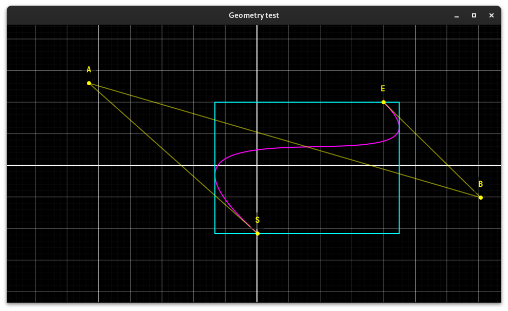
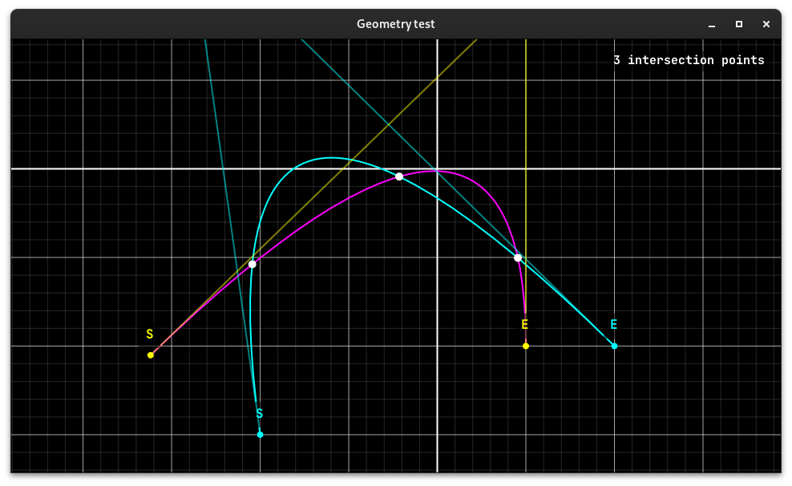

# Matlin
A Kotlin Bézier curve library, intended for vector graphics.

The computation of an axis aligned bounding box around a cubic Bézier curve.

The points of intersection of two quadratic Bézier curves, which is hard to calculate algebraically. A simple numerical approach is used instead.

## Supported features
Three types of Bézier curves are supported: linear, quadratic and cubic.

The following operations are done purely algebraically: no iterative algorithm is involved in these operations.
- Sampling the curve.
- Sampling the derivative and second derivative of the curve.
- Representing the X and Y parameters of the curve as polynomials.
- Reconstructing the curve from its X and Y polynomials.
- Converting curves to higher orders.
- Computing the derivative curve as a Bézier curve.
- Computing the bounding box of the curve.
- Subdividing the curve at any point along the curve.
- Extending the curve beyond its endpoints.
- Cutting the curve at its extrema.
- Computing the intersections with the curve and a straight line.
- Dragging a point on the curve to another point.
- Computing a nonlinearity factor (i.e. the "curviness") of the curve.

The following operations are impossible to be done algebraically and are computed using an iterative algorithm that numerically approaches the solution we are looking for. Only for linear curves does the situation simplify to simple linear algebra and can it be solved algebraically.
- Computing the length of the curve.
- Computing the point at a certain length along the curve.
- Computing the intersections between two curves.
- Computing the intersections between a curve and a circle.
- Computing the the point on the curve with least distance to some point.
- Approximating a cubic curve with a spline of quadratic curves.

## The nonlinearity factor and numerical approaching
The numerical approaches are heavily dependent on the "nonlinearity factor" of the curve. This factor is 0 if the curve is a perfectly straight line and gets bigger as the curve becomes more curvy. It's an algebraic approximation of how far the curve deviates from being a perfect line. This makes it possible to set a threshold on the nonlinearity factor: if the nonlinearity factor of a curve is close enough to zero, it can be approximated by a straight line without too much error.

The nonlinearity factor satisfies two important properties:
1. If the curve is scaled by a factor of `n`, then the nonlinearity factor also scales by a factor of `n`.
2. If we cut a curve into two separate curves by subdivision, the separate curves must both have a smaller nonlinearity factor than the original curve.

The first property is important because a very long curve may look like a line, but we can see that it visually deviates from a line near the middle. However, an equally shaped curve that is very tiny can barely be told a part from a tiny line, so it's safe to approximate.

The importance for the second property may seem to come out of thin air, but it's important because it allows very accurate numerical approaches to be made using a rather simple divide and conquer algorithm. The algorithm works as follows:
- The base case is a curve which is close enough to being a straight line that we can approximate it using linear algebra. We can test for the base case by setting a simple threshold on the nonlinearity factor.
- Curves that are too curvy will be subdivided and the computation can be done on the two separate curves. Because the nonlinearity factor of a subdivision of the curve is less than the nonlinearity factor of the original curve, the recursion will eventually settle on a section of the curve that satisfies the base case.

Now it's easy to see why this property is important: if it did not hold, there could be cases where the nonlinearity becomes bigger as the recursion goes deeper, and the algorithm will never terminate (theoretically, that is - in practice it will run out of memory or cause a stack overflow at some point).

The nonlinearity threshold is inversely related to the accuracy of a numerical approach and the default threshold can be overridden for all operations. Note that a very small threshold results in more accurate results, but more expensive computation, whereas a large threshold results in inaccurate results but faster computation.

### Example: computing the length of a curve
We know the length of a straight line can be found using the Pythagorean theorem. This is thus a simple algebraic computation. However, the length of a higher order Bézier curve is tricky if not impossible to find algebraically. For a quadratic curve one could rotate the parabola segment of the curve such that it lines up with the Y-axis, and then use an integral on its derivative to compute the length, but this requires a lot of numerically unstable calculations. For a cubic curve, it is simply impossible to find the length. Thus, we would like to numerically approximate the length of a curve.

We could use the above algorithm.
- The base case is a curve so close to a straight line that it may as well be considered a straight line. That is, the nonlinearity factor is below some constant threshold. In this case we simply calculate the distance between the two endpoints of the curve, as if it was a straight line, using the Pythagorean theorem.
- Is the curve too curvy, then we split the curve in two halves. It really doesn't matter where you cut but the most optimal place would be to cut the curve evenly. Thus, we cut at `t = 0.5`. Then, we recursively call our algorithm on the two subdivisions, giving us the lengths of the two subdivisions. We sum these to obtain the length of our curve.

Since the nonlinearity factor of a curve always goes down when subdividing, this algorithm converges to a value that is a numerical approximation of the curve's length.

Determining the complexity of this algorithm is tricky because we don't perform it on some discrete structure, but on a continuous function. However, let `l` be the length of the curve, then this algorithm is roughly `O(l log l)`. If we made a spline of line segments that approximates the curve simply by sampling the curve at many points, then we'd have `O(l)`, but in practice the algorithms don't compare much in computation speed.
